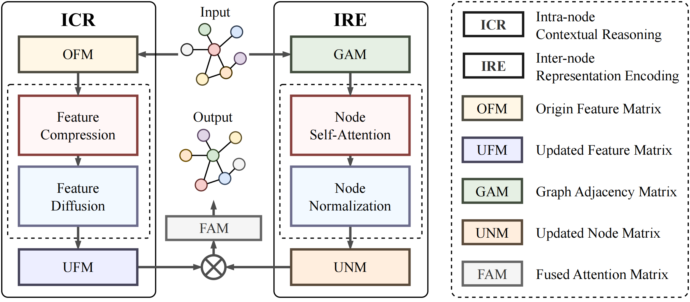
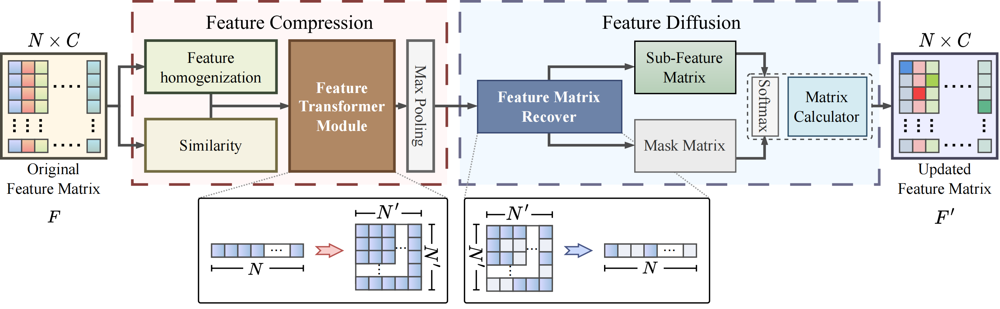
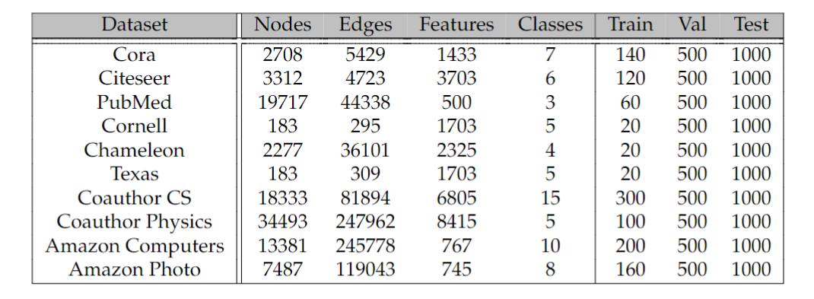
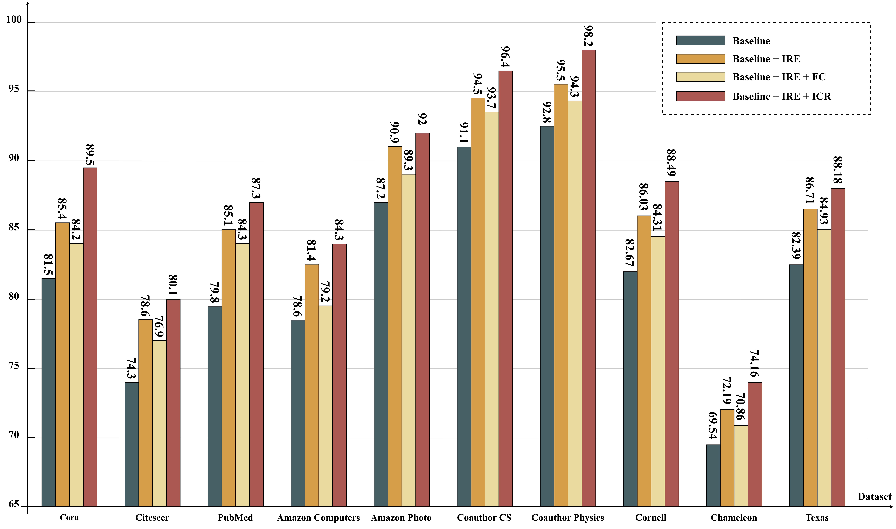

# DAG: Dual Attention Graph Representation Learning for Node Classification

> More details of this project will be released soon.

# Introduction
The DAG approach addresses the limitations of the traditional uniform message-passing strategy by considering both the link relationships among nodes and the attributes of the nodes themselves. we leverage a dual branch mechanism to comprehend intra-node and inter-node dynamics, enabling a more comprehensive understanding of information propagation within graphs.

The Inter-node Representation Encoding (IRE) branch analyzes differences among nodes on the graph and examines the contribution of neighboring nodes. On the other hand, the Intra-node Contextual Reasoning (ICR) branch explores individual node attributes and dynamically updates the feature matrix of graph nodes based on the current node category. By combining these two branches, DAG facilitates more effective information propagation and enhances node classification performance.

# ICR Module
The ICR can be divided into two interconnected sequential modules, FC and FD, which are presented separately in the red dashed box and the blue dashed box.

# Experiments and Results
**Datesets**

**Ablation**

